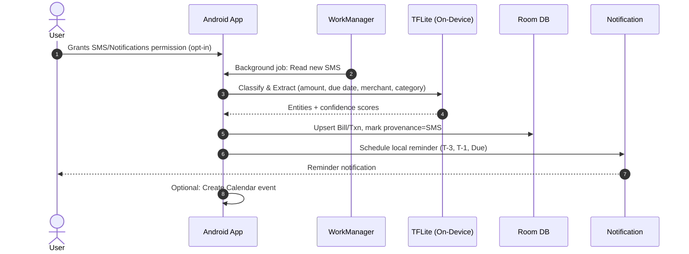
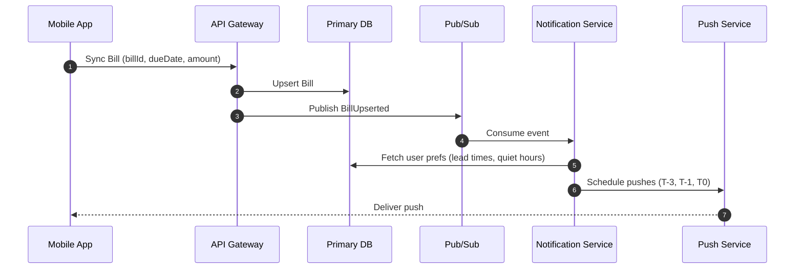
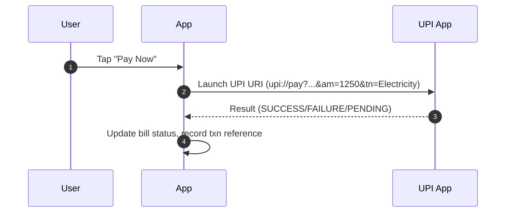
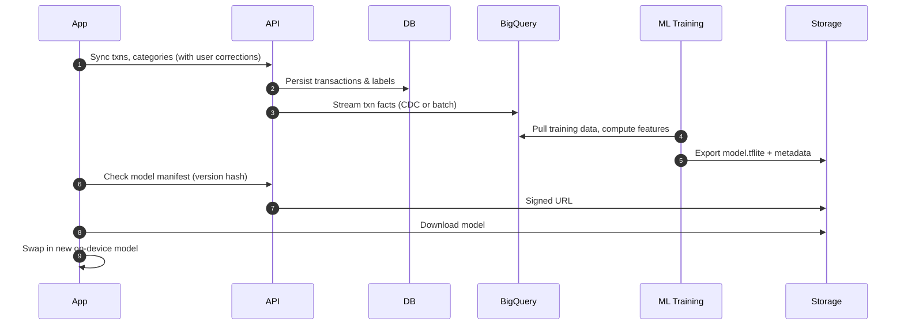
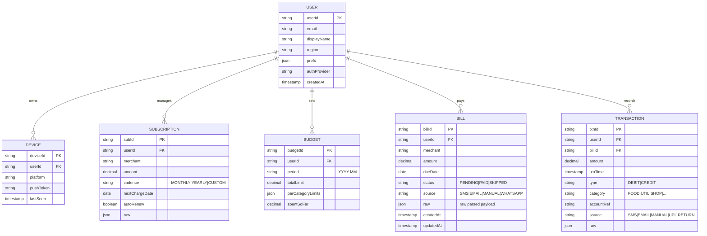
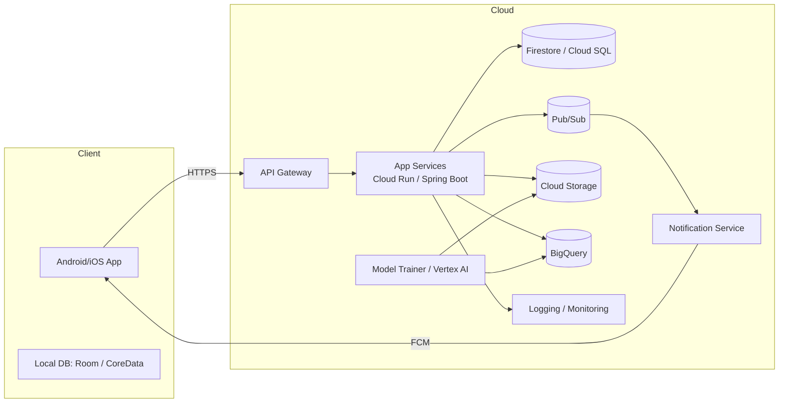
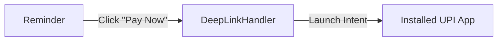

# AI Bill & Payment Reminder + Expense Tracker — Architecture (MVP → Full)

> A detailed, production-ready architecture that scales from a focused MVP to a full AI Life Organizer.  
> Includes C4-style diagrams, data models, event flows, and service boundaries.

---

## 🧭 Goals & Non-Goals

**Goals**
- Zero-effort bill detection from SMS/Email/WhatsApp (with consent)
- Reliable reminders & calendar integration
- Auto-categorized expenses with on-device AI
- Private-by-default with offline-first UX
- Evolves to family sharing, health habits, unified planner

**Non-Goals (MVP)**
- Full bank account aggregation (pluggable later)
- Complex multi-currency accounting
- Enterprise admin/role hierarchy

---

## 🧱 High-Level Stack

- **Client (Android-first MVP):** Kotlin, Jetpack Compose, WorkManager, Room, MLKit/TensorFlow Lite
- **iOS (Phase 2+):** SwiftUI, CoreData, BackgroundTasks, TFLite
- **Backend (Managed-First):** Firebase Auth (OIDC), Firebase Cloud Messaging (FCM), Firestore or Cloud SQL (Postgres), Cloud Functions / Cloud Run (Spring Boot optional), Cloud Scheduler, Cloud Storage, BigQuery
- **AI/ML:**
  - **On-device:** TFLite models for SMS classification + entity extraction (amount, merchant, due date, txn type)
  - **Cloud-side (Phase 3+):** Model training & analytics on BigQuery + Vertex AI / Cloud AI Platform
- **Eventing:** Pub/Sub topic(s) for async jobs, outbox pattern from services
- **Observability:** Cloud Logging + Error Reporting + OpenTelemetry traces
- **Security:** Firebase Auth + OAuth2 (OIDC), Cloud IAM, Secret Manager, end-to-end encryption at rest; optional client-side field encryption for sensitive payloads

---

## 🗺️ C4 Model — System Context

```mermaid
C4Context
title System Context Diagram
Person(user, "End User", "Wants effortless bill reminders & expense tracking")
System_Boundary(app, "AI Bill & Payment Assistant") {
  System(mobile, "Mobile App (Android/iOS)", "Reads messages, offline-first, on-device AI")
  System_Ext(calendar, "Google/Apple Calendar", "User calendar for reminders")
  System_Ext(email, "Email Provider", "Gmail/IMAP for bill emails (opt-in)")
  System_Ext(whatsapp, "WhatsApp Business", "Bill/txn messages (opt-in, Phase 2)")
  System_Ext(payments, "UPI/Payment Apps", "Deep-links for one-tap pay")
  System_Ext(push, "FCM/APNs", "Push notifications delivery")
  System_Ext(auth, "Firebase Auth (OIDC)", "Identity & tokens")
  System(cloud, "Backend Services", "APIs, analytics, model training")
}

Rel(user, mobile, "Uses")
Rel(mobile, auth, "Authenticate / Refresh tokens")
Rel(mobile, push, "Receives reminders/alerts")
Rel(mobile, calendar, "Create events/reminders")
Rel(mobile, email, "Optional: read bills", "OAuth/IMAP with consent")
Rel(mobile, whatsapp, "Optional: ingest business msgs", "Android permissions")
Rel(mobile, payments, "Launch pay intent", "Deep links / UPI URI")
Rel(mobile, cloud, "Sync data / config / flags", "HTTPS")
````

---

## 🧩 C4 Containers — MVP to Full

```mermaid
flowchart TD
    subgraph APP["AI Bill & Payment Assistant"]
        mobile["Mobile App\n(Kotlin/Swift)\nUI, local DB, on-device ML, background sync"]
        room["Local Store\n(Room/CoreData)\nOffline-first data"]
        api["API Gateway\n(Cloud Run/Functions + API Keys)\nEdge routing, rate limiting"]
        auth["Auth\n(Firebase Auth)\nOIDC identity & tokens"]
        db["Primary DB\n(Firestore / Cloud SQL)\nUsers, bills, txns, budgets, subscriptions"]
        bus["Event Bus\n(Pub/Sub)\nAsync processing"]
        notify["Notification Service\n(Cloud Run/Functions)\nSchedules & sends reminders via FCM/APNs"]
        sync["Sync & Reconciliation\n(Cloud Run/Functions)\nConflict resolution, dedupe, merge"]
        ml_svc["ML Training Service\n(Vertex AI/Cloud Run)\nPeriodic training, model registry"]
        storage["Object Storage\n(Cloud Storage)\nExports, model binaries"]
        analytics["Analytics/Warehouse\n(BigQuery)\nAggregations, cohort, churn, insights"]
        observe["Observability\n(Cloud Logging/OTel)\nLogs, traces, metrics"]
    end

    mobile --> room
    mobile --> api
    api --> auth
    api --> db
    api --> bus
    bus --> notify
    bus --> sync
    ml_svc --> storage
    ml_svc --> analytics
    api --> storage
    notify -->|"Push via FCM/APNs"| mobile
    mobile <-->|"Download model.tflite"| storage

```

---

## 🧠 On-Device AI Flow (MVP)



---

## 🔔 Reminder Scheduling (Cloud Augmentation)



---

## 💳 One-Tap Pay (UPI Deep Link)



---

## 🧮 Budget & Insights (Phase 2–3)



---

## 🗄️ Data Model (ER Diagram — Core)



---

## 🔐 Security & Privacy Architecture

* **Identity:** Firebase Auth (OIDC). Access token → API Gateway → per-user isolation.
* **Data Minimization:** Only ingest messages from opted-in channels. Process on-device when possible.
* **At Rest:** Server-side encryption (KMS). Optional client-side field encryption (e.g., amounts/merchant).
* **In Transit:** TLS 1.2+ end-to-end.
* **Access Control:** Row-level security via userId partitioning; Firestore rules or SQL RLS.
* **Secrets:** Cloud Secret Manager (payment webhook keys, signing keys).
* **PII Handling:** Separate PII columns/tables; field-level encryption for emails/phone; tokenization for push tokens.
* **Compliance-Ready:** Audit logs for access; data export/delete (GDPR CCPA readiness).
* **Safety:** Rate limiting, bot detection, replay protection on pay-intent callbacks.

---

## 🧵 Background Jobs & Event Taxonomy

**Topics**

* `bill.upserted`, `bill.status.changed`
* `txn.ingested`, `txn.categorized`, `txn.corrected`
* `subscription.detected`, `subscription.renewed`
* `reminder.schedule.requested`, `reminder.sent`
* `model.training.requested`, `model.published`

**Workers**

* Reminder Scheduler → consumes `bill.upserted` to plan FCM pushes
* Dedupe/Reconciliation → merges duplicate bills/txns from multiple sources
* Subscription Predictor → estimates `nextChargeDate`
* Export/Report Generator → PDF/CSV monthly reports to Cloud Storage (signed URLs)
* Model Trainer → pulls from BigQuery; writes artifacts to Storage

---

## 🧪 Testing Strategy

* **Client:** Unit (parsers, reducers), instrumentation tests (WorkManager, Room), screenshot tests
* **On-Device ML:** Golden test fixtures for SMS → entities; threshold & fallback to regex
* **API:** Contract tests (OpenAPI), auth tests (token validation), property-based tests for parsers
* **Load:** Reminder fan-out (N users × M reminders); soak tests on FCM throughput
* **Chaos:** Event bus latency injection and retry/backoff validation

---

## 🔄 Sync & Conflict Resolution

* **Versioning:** `row.version` (Lamport timestamps) for last-writer-wins on simple fields
* **Merge Strategy:** For bills, merge if (merchant, amount, dueDate) within fuzzy thresholds
* **Provenance:** Retain source evidence (SMS/EMAIL/WHATSAPP/MANUAL) + raw payload for traceability
* **Client Queues:** Outbox on-device; retries with exponential backoff

---

## 📈 Feature Flags & Remote Config

* Gradually enable: WhatsApp ingest, email ingest, new ML model versions, predictive cash flow
* Store in Remote Config/Firestore; cached on-device; rollout by cohort/region/appVersion

---

## 🧰 API Surface (Representative)

### Auth

* `POST /v1/auth/exchange` – exchange Firebase token → backend session (optional)
* `GET /v1/me` – profile & prefs

### Bills

* `GET /v1/bills?status=&from=&to=`
* `POST /v1/bills` – create/update (idempotent by `clientGeneratedId`)
* `POST /v1/bills/{id}/status` – `PAID|SKIPPED`
* `GET /v1/bills/{id}`

### Transactions

* `GET /v1/txns?category=&from=&to=`
* `POST /v1/txns` – bulk upsert (max 500)
* `PATCH /v1/txns/{id}` – correct category

### Subscriptions

* `GET /v1/subscriptions`
* `POST /v1/subscriptions` – detect or add manual
* `PATCH /v1/subscriptions/{id}` – edit cadence/amount

### Budgets

* `GET /v1/budgets?period=YYYY-MM`
* `PUT /v1/budgets/{period}` – set totals & per-category limits

### Models

* `GET /v1/models/current` – manifest (hash, size, url, minAppVersion)

### Exports

* `POST /v1/exports?type=PDF|CSV&period=YYYY-MM`
* `GET /v1/exports/{exportId}` – signed URL

---

## 🧭 Deployment Topology



---

## 🗓️ Roadmap Roll-Up (Infra Switches by Phase)

* **Phase 1 (MVP):** Firestore, Cloud Functions, FCM, Remote Config, on-device TFLite
* **Phase 2:** Add Cloud Run services (subscriptions, budgets), WhatsApp ingest (Android only), email ingest (OAuth/IMAP)
* **Phase 3:** BigQuery pipelines, model auto-rollout, exports, predictive cash flow, Web app
* **Phase 4:** Planner + Health integrations, Family accounts, Shared budgets

---

## ⚙️ Android Client Layering (MVP)

```
ui/            ← Jetpack Compose screens
viewmodel/     ← State + business logic (MVI)
domain/        ← Use cases (ScheduleReminders, SyncBills, CategorizeTxn)
data/
  repo/        ← BillRepo, TxnRepo, ModelRepo
  local/       ← Room DAOs, entities
  remote/      ← Retrofit/Grpc clients
  ml/          ← TFLite runners + feature extractors
  parsers/     ← SMS/Email regex + hybrid extraction
workers/       ← WorkManager periodic/constraints
di/            ← Hilt modules
```

---

## 🔄 Hybrid Extraction Strategy

1. **Classifier (TFLite):** txn vs non-txn; bill vs non-bill
2. **Entity Extractor (TFLite or rules):** amount, dueDate, merchant, txnType
3. **Regex/Rules Fallback:** when confidence < threshold
4. **User Corrections:** captured → server → re-training features

---

## 🧯 Failure & Retry Policies

* **WorkManager:** exponential backoff, network/charging constraints
* **Event Consumers:** at-least-once; idempotent handlers via `idempotency_key`
* **Payment Deep Links:** handle `PENDING` → reminder to confirm
* **Notification Quiet Hours:** defer until window opens

---

## 📤 Example Notification Payload

```json
{
  "type": "BILL_DUE",
  "billId": "b_123",
  "title": "Electricity bill due in 2 days",
  "body": "₹1,250 to BESCOM by Fri, Aug 15",
  "actions": [
    {"label": "Pay Now", "intent": "upi://pay?..."},
    {"label": "Snooze", "intent": "app://bill/b_123/snooze?days=1"}
  ]
}
```

---

## 🧱 Config & Secrets

* `REMOTE_CONFIG`: feature flags, thresholds, model version, sampling rates
* `SECRETS`: FCM server key, OAuth client secrets (email), signing keys
* `ENV`: per env (dev/stage/prod) endpoints, DB connection

---

## 📑 OpenAPI Skeleton (Excerpt)

```yaml
openapi: 3.0.3
info:
  title: AI Bill & Expense API
  version: 1.0.0
servers:
  - url: https://api.example.com
security:
  - firebaseAuth: []
components:
  securitySchemes:
    firebaseAuth:
      type: http
      scheme: bearer
      bearerFormat: JWT
paths:
  /v1/bills:
    get:
      summary: List bills
    post:
      summary: Upsert bills (idempotent)
  /v1/bills/{id}/status:
    post:
      summary: Update bill status
  /v1/txns:
    post:
      summary: Bulk upsert transactions
```

---

## 🛡️ Observability & SLOs

* **SLO Examples**

  * Reminder delivery success ≥ 99% within ±5 minutes of schedule
  * API p95 latency < 300ms; error rate < 0.5%
  * Model rollout rollback < 10 minutes upon elevated error budgets
* **Dashboards**

  * Bill ingestion rate, reminder send/receive funnel, categorization accuracy by cohort, crash-free users, cold start rate

---

## 🧭 Migration Paths

* **Firestore → Cloud SQL:** use dual-write with CDC to minimize downtime
* **Functions → Cloud Run/Spring Boot:** keep OpenAPI stable; deploy side-by-side; cutover via gateway routes
* **On-Device Model Upgrades:** staged percentage rollouts; A/B compare precision/recall

---

## ✅ MVP Definition of Done

* On-device SMS extraction + reminders
* Manual bill add/edit
* Expense auto-categorization with correction UX
* Offline-first + cloud sync
* Push notifications with quiet hours
* Basic privacy dashboard (what’s collected, revoke)

---

## 📎 Appendix: Example UPI Deep Link

[Example UPI Link](upi://pay?pa=merchant@upi&pn=ElectricityBoard&mc=0000&tid=TXN12345&tr=BILL12345&tn=Electricity%20Bill&am=1250&cu=INR)


